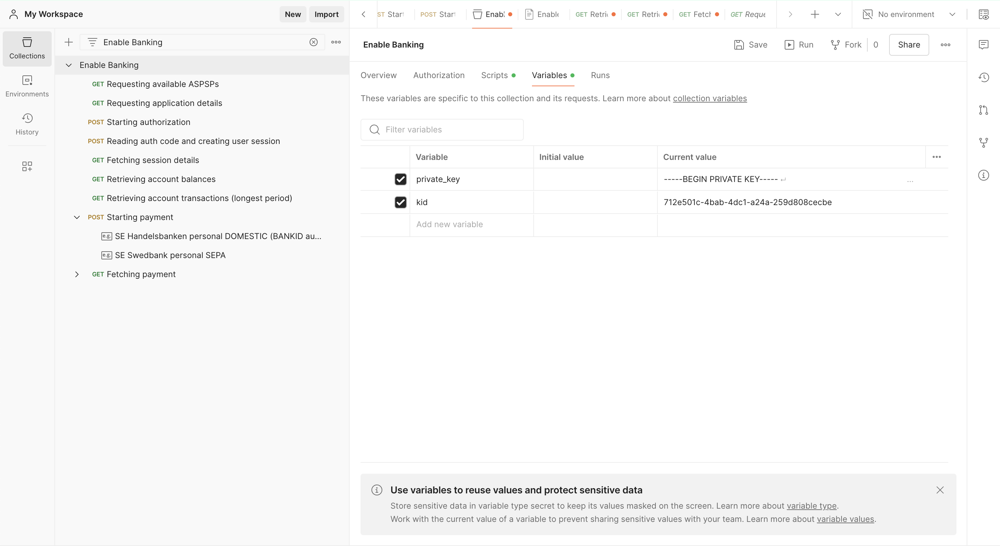

Please note: Each API request needs a JWT token, which is generated in the pre-request script from the collection. For using this, add your application private key (variable name - 'private_key') and kid (variable name - 'kid') to the collection variables.

